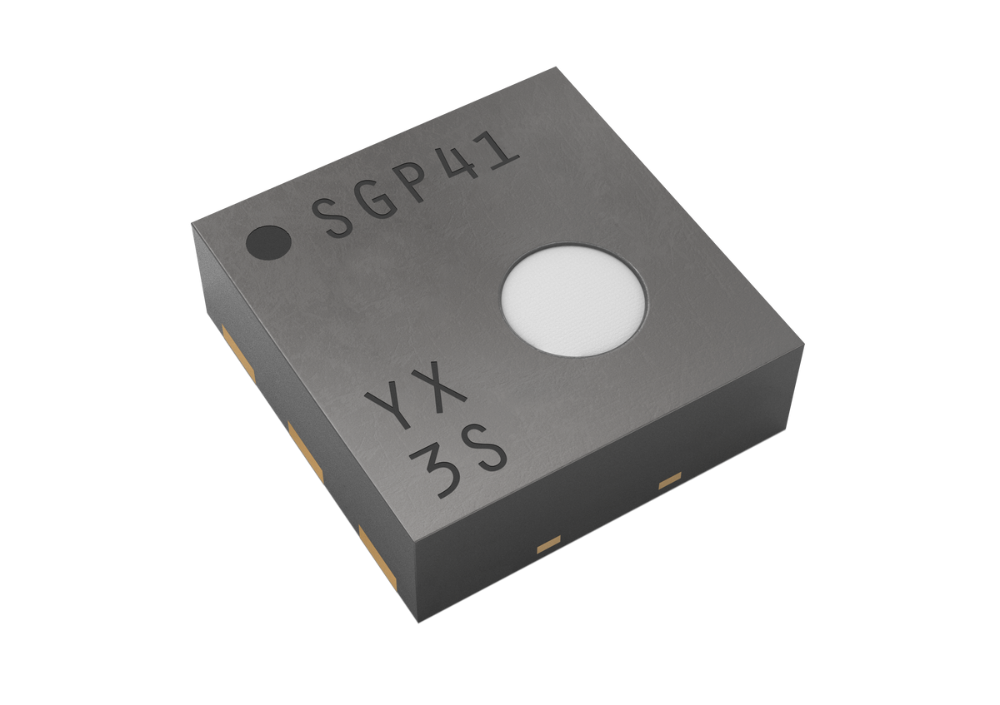

# Sensirion Raspberry Pi I2C SGP41 Driver

This document explains how to set up the SGP41 sensor to run on a Raspberry Pi
using the provided code.

[<center></center>](https://www.sensirion.com/en/environmental-sensors/gas-sensors/sgp41)

Click [here](https://www.sensirion.com/en/environmental-sensors/gas-sensors/sgp41) to learn more about the SGP41 Sensor.


## Setup Guide

### Connecting the Sensor

Your sensor has the four different connectors: VCC, GND, SDA, SCL. Use
the following pins to connect your SGP41:

 *SGP41*  |    *Raspberry Pi*
 :------: | :------------------:
   VCC    |        Pin 1 (3.3V)
   GND    |        Pin 6
   SDA    |        Pin 3
   SCL    |        Pin 5

<center></center>

### Raspberry Pi

- [Install the Raspberry Pi OS on to your Raspberry Pi](https://projects.raspberrypi.org/en/projects/raspberry-pi-setting-up)
- [Enable the I2C interface in the raspi-config](https://www.raspberrypi.org/documentation/configuration/raspi-config.md)
- Download the driver for the [Sensirion Github Page](https://github.com/Sensirion/raspberry-pi-i2c-sgp41) and extract the `.zip` on your Raspberry Pi
- Compile the driver
    1. Open a [terminal](https://www.raspberrypi.org/documentation/usage/terminal/?)
    2. Navigate to the driver directory. E.g. `cd ~/raspberry-pi-i2c-sgp41`
    3. Run the `make` command to compile the driver

       Output:
       ```
       rm -f sgp41_i2c_example_usage
       cc -Os -Wall -fstrict-aliasing -Wstrict-aliasing=1 -Wsign-conversion -fPIC -I. -o sgp41_i2c_example_usage  sgp41_i2c.h sgp41_i2c.c sensirion_i2c_hal.h sensirion_i2c.h sensirion_i2c.c \
           sensirion_i2c_hal.c sensirion_config.h sensirion_common.h sensirion_common.c sgp41_i2c_example_usage.c
       ```
- Test your connected sensor
    - Run `./sgp41_i2c_example_usage` in the same directory you used to
      compile the driver.

      Output:
      ```
      SRAW VOC: 25720
      SRAW NOx: conditioning
      SRAW VOC: 25846
      SRAW NOx: conditioning
      ...
      SRAW VOC: 25951
      SRAW NOx: 15656
      SRAW VOC: 26153
      SRAW NOx: 15612
      SRAW VOC: 26278
      SRAW NOx: 15553
      ...
      ```

## Conditioning

After each restart of the sensor or when the hotplates have been switched off, the conditioning command must
be called from idle mode. The conditioning heats the hotplate of the NOx pixel to a different temperature compared
to the measurement mode enabling a faster switch-on thereafter.

It is recommended to execute the conditioning for 10s, but **10s must not be exceeded** to avoid damage to the sensing material.

## Troubleshooting

### Initialization failed

-   Ensure that you connected the sensor correctly: All cables are fully
    plugged in and connected to the correct pin.
-   Ensure that I2C is enabled on the Raspberry Pi. For this redo the steps on
    "Enable the I2C interface in the raspi-config" in the guide above.
-   Ensure that your user account has read and write access to the I2C device.
    If it only works with user root (`sudo ./sgp41_i2c_example_usage`), it's
    typically due to wrong permission settings.
